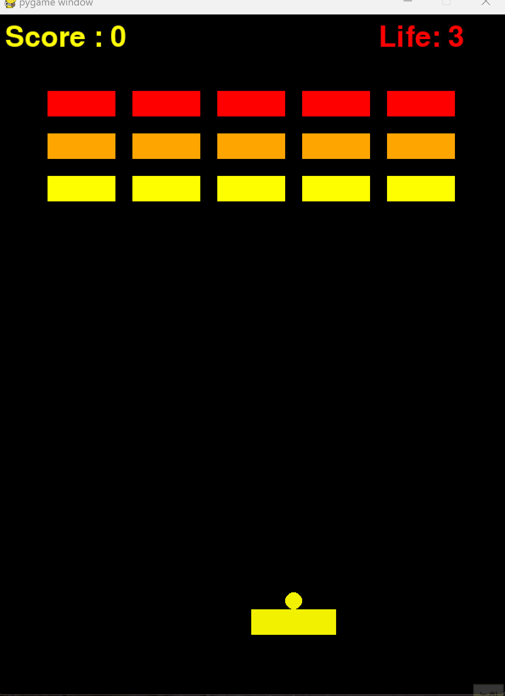

# 🎮 블록 깨기 게임 (Breakout Game)  

## 📋 프로젝트 개요  
이 프로젝트는 **Pygame**을 사용해 구현한 고전 아케이드 게임인 "블록 깨기"입니다.  
플레이어는 패들을 움직여 공을 튕기며 블록을 깨야 합니다.   
  
## 🚀 추가 구현 기능  
### [1] 블록을 깨면 20% 확률로 아이템이 떨어지는 기능  
- 블록을 깰 때마다 **20% 확률**로 아이템이 떨어집니다.  
- 아이템은 **빨간색 공** 또는 **파란색 공**으로 랜덤하게 생성됩니다.  
  
### [2] 빨간색 공 아이템을 패들이 먹으면 공 하나가 추가로 발사되는 기능  
- 빨간색 아이템을 패들이 받아내면, 패들 위에서 **추가 공이 하나 더 생성**되어 블록을 더 빨리 깰 수 있습니다.  
- 게임이 더욱 역동적이고 재미있어집니다.  

---

## 🕹️ 게임 방법  
1. **게임 시작**  
   - 게임을 실행하고 **스페이스 바(SPACE)**를 누르면 시작됩니다.  
   - 공은 패들 위에서 시작되며, 패들이 움직이면 함께 따라 움직입니다.  

2. **패들 조작**  
   - **← (왼쪽 방향키)**: 패들이 왼쪽으로 이동합니다.  
   - **→ (오른쪽 방향키)**: 패들이 오른쪽으로 이동합니다.  

3. **목표**  
   - 공을 튕겨서 **블록을 모두 깨는 것**이 목표입니다.  

4. **아이템 시스템**  
   - 블록이 깨질 때 **20% 확률**로 아이템이 떨어집니다.  
   - 아이템이 패들과 충돌하면 효과가 발생합니다.  
     - **빨간색 아이템**: 추가 공 1개 발사  
     - **파란색 아이템**: (현재 구현 안됨, 추가 가능)  

5. **게임 종료**  
   - 모든 공을 놓치면 **생명이 하나 감소**하며, 모든 생명이 사라지면 **게임 오버**가 됩니다.  
   - 모든 블록을 깨면 **게임 클리어** 메시지가 표시됩니다.  

---

## 🎥 실행 화면  
  
위 화면은 게임 실행 모습입니다. 빨간색 아이템이 떨어지는 장면을 볼 수 있습니다.  

---

## 🛠️ 실행 방법  
### 환경 설정  
- Python 3.10 이상 설치 (권장)  
- Pygame 설치  
```bash
pip install pygame
python run.py
```
## 👥 기여자 (Contributor)
- 구현자: natastae | https://github.com/natastae
- 프로젝트 매니저: ykm20651 | https://github.com/ykm20651

